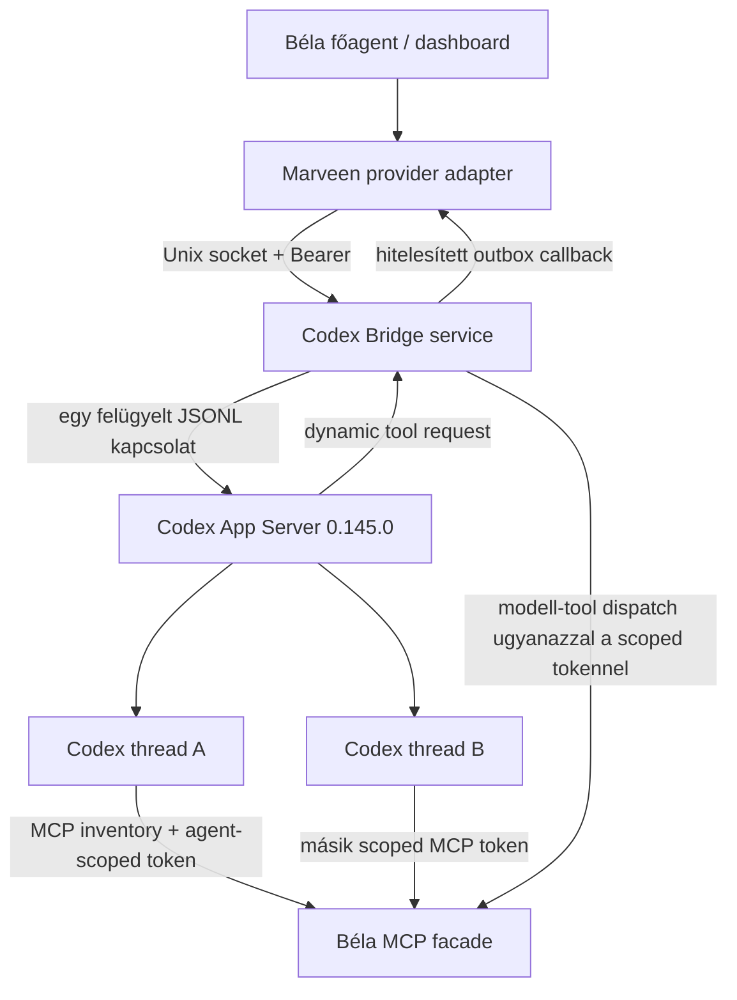

# Béla Codex Bridge 0.1.8

Különálló, frissítésálló szolgáltatás, amely egy ChatGPT-előfizetéssel
bejelentkezett Codex CLI-t Béla alá rendelt agent-providerként tesz elérhetővé.
Béla Node 24-en és Claude Code-dal változatlanul fut; a Bridge saját, rögzített
Node 22.23.1 környezetet használ.

## Mit tud ez a kiadás?

- Codex-agent létrehozása a Béla agent-wizardból;
- provider- és `gpt-5.6-terra` modellválasztás;
- start, stop, restart és fresh-thread;
- tartós Codex thread és restart utáni resume;
- Béla agent→Codex üzenetküldés tmux használata nélkül;
- idempotens run-létrehozás (`bela-message-<id>`);
- pontosan egyszer feldolgozott completion callback;
- provider callback csak Béla-üzenethez kötött runhoz, ezért a közvetlen API
  runok nem hoznak létre hibás outbox retry-sort;
- azonos runablakban a dynamic toollal már elküldött és a végválaszban
  megismételt agentüzenet pontos deduplikációja;
- Codex válaszának visszaírása a küldő Béla-agent inboxába;
- SQLite WAL állapot, queue, események, outbox és approval;
- globális 2 / agentenként 1 konkurens run;
- interrupt API;
- Codex approvalok megjelenítése a Béla felületén;
- approval request ID biztonságos újrafelhasználása, App Server generationnel
  naplózva, globális SQLite UNIQUE ütközés nélkül;
- agentenként külön, HMAC-kötött MCP capability token;
- scoped MCP eszközök:
  - `bela_agent_message_send`;
  - `bela_agent_message_status`;
  - `bela_memory_search`;
  - `bela_memory_get`;
- ugyanennek a négy funkciónak App Server `dynamicTools` kivetítése, amely
  közvetlenül a modell toolsetjébe kerül és megkerüli a Codex 0.145.0
  MCP-inventory→modell-exposure hibáját;
- az `item/tool/call` kérések fail-closed kötése az aktív runhoz, threadhez,
  turnhöz és agent HMAC-identitáshoz;
- minden run előtt App Server MCP-inventory ellenőrzés; a négy kötelező Béla
  tool hiányában a run fail-closed módon leáll;
- MCP startup státusz és hiba megjelenítése a Bridge journalban;
- Béla scheduler → Codex queue útvonal;
- Codex-agent kizárása a Claude/tmux auto-restart, context-guard és model-fallback
  útvonalakból;
- privát Unix socket (`0600`) és külön systemd user service;
- verzió- és modell-kompatibilitási fail-closed ellenőrzés.

## Architektúra



A Marveen-frissítés nem írhatja felül a Bridge adatbázisát, tokenjét,
runtime-ját vagy systemd unitját. Az adapter telepítő a Marveen verziója alapján
választja ki a hozzá tartozó patch-et és baseline hash manifestet.

Támogatott, fail-closed adapter:

| Marveen | Adapter | Approval felület |
|---|---|---|
| 1.21.1 | erre a ténylegesen futó forrásra portolt és 0.1.2-ről frissíthető adapter | külön Codex approval panel a Csapat oldalon |

A 0.1.8 telepítő más Marveen-verzión módosítás nélkül leáll. A korábbi
1.23.2 patch a csomagban csak történeti kompatibilitási artefakt; a 0.1.4
Codex-agent-létrehozási javítása azon a verzión nincs validálva, ezért a
telepítő nem alkalmazza.

Eltérő verzió, hiányzó fájl vagy egyetlen eltérő baseline hash esetén a
telepítő még a Bridge fájljainak módosítása előtt leáll. A patch alkalmazása
előtt külön dry-run is fut.

## Telepítés a tesztelt WSL gépen

Előfeltételek:

- Béla: `~/marveen`;
- Béla alapértelmezett Node: 24.16.0;
- Bridge Node: `~/.nvm/versions/node/v22.23.1/bin/node`;
- Codex: `~/.local/bin/codex`, 0.145.0;
- `codex login status` → `Logged in using ChatGPT`;
- a ChatGPT-előfizetéssel tesztelt modell: `gpt-5.6-terra`.

Kicsomagolás után:

```bash
cd ~/bela-codex-bridge-0.1.8
./scripts/install.sh --marveen-root "$HOME/marveen"
```

Ha a Bridge és az adapter ellenőrzése után Béla is azonnal újraindítható:

```bash
./scripts/install.sh \
  --marveen-root "$HOME/marveen" \
  --restart-bela
```

A telepítő:

1. ellenőrzi a rögzített Node/Codex verziót és a ChatGPT login állapotot;
2. minden módosítás előtt ellenőrzi a Marveen verziót, baseline hash-eket és a
   patch dry-runt;
3. migráció előtt konzisztens SQLite backupot készít a meglévő Bridge
   adatbázisról;
4. atomikusan létrehozza a Bridge release könyvtárat;
5. generál egy 256 bites tokent `0600` jogosultsággal;
6. generálja a gépre szabott configot;
7. telepíti és elindítja a systemd user service-t;
8. ellenőrzi a socketet, beareres authot, Codex modellt és App Server
   kompatibilitást;
9. timestampelt mentést készít, majd patcheli Marveent;
10. a Béla által ténylegesen használt Node 24 alatt Marveen typechecket,
    JavaScript syntax-checket és verzióspecifikus célteszteket futtat;
11. kötelezően újraépíti a Marveen `dist` könyvtárát, majd ellenőrzi, hogy a
    futtatott JavaScriptben is jelen van a Codex provider, router és
    agent-inicializálás;
12. hiba esetén automatikusan visszaállítja a módosított forrásfájlokat és a
    telepítés előtti teljes `dist` könyvtárat, a hibás buildet pedig félreteszi
    a diagnosztikához az esetleg létrejött új fájlokat;
13. `--restart-bela` esetén külön újraindítja a `bela-dashboard.service`
    folyamatot, mert a lemezen frissített `dist` önmagában nem cseréli le a
    Node memóriájában futó régi modulokat;
14. ellenőrzi, hogy a dashboard process nem régebbi a `dist/index.js` buildnél;
15. végül ellenőrzi a Marveen forrás- és lefordított integrációs hookokat.

Ha korábbi telepítés megállt, vagy a forrás már új, de a futó `dist` régi,
nem kell kézzel takarítani: a 0.1.8 telepítő
futtatható fölötte. A meglévő Bridge-token, adatbázis és konfiguráció megmarad.
A már telepített 0.1.6 Marveen-adaptert külön, pontos hash-ekkel ellenőrzött
inkrementális patch frissíti.

## Első Codex-agent

1. Nyisd meg Béla Agents oldalát.
2. Válaszd az „Új ügynök” lehetőséget.
3. Az „Agent motor” mezőben válaszd az „OpenAI Codex Bridge” opciót.
4. Modell: `GPT-5.6 Terra`.
5. Hozd létre, majd indítsd el az agentet.
6. Küldj neki egy rövid feladatot egy másik Béla-agentből.
7. A válasznak a küldő inboxába kell visszaérkeznie.

## Üzemeltetés

```bash
systemctl --user status bela-codex-bridge.service
journalctl --user -u bela-codex-bridge.service -f
./scripts/verify-install.sh "$HOME/marveen"
```

Bridge-only leállítás:

```bash
systemctl --user stop bela-codex-bridge.service
```

Ez nem állítja le Bélát és a Claude-agenteket. A Codexnek címzett új üzenetek
pending állapotban maradnak, majd a Bridge visszatérésekor újrapróbálódnak.

Eltávolítás:

```bash
./scripts/uninstall.sh
```

Az uninstall szándékosan megőrzi az adatbázist, tokent, release-eket és az
adapter előtti mentést. A Marveen adapter visszaállítása csak explicit,
timestampelt mentésből történjen. A mentések helye:

```text
~/.local/state/bela-codex-bridge/adapter-backups/marveen-<verzió>/<timestamp>/
```

## Frissítési szabály

Marveen frissítése előtt:

1. állítsd le a Bridge-et;
2. frissítsd Marveent;
3. ne futtasd vakon a régi adapter patch-et;
4. készíts új baseline hash manifestet;
5. alkalmazd a patch-et egy másolaton;
6. futtasd a Marveen typechecket, célzott teszteket és a Bridge contract tesztet;
7. csak ezután telepítsd az új adapter-verziót.

Codex CLI frissítésnél a `codex.expectedVersion` szándékosan blokkolja az
indulást. Előbb az App Server contract és izolációs preflight tesztet kell
lefuttatni, majd a lock fájl és a config verzióját együtt emelni.

## Korlátok ebben a kiadásban

- Közvetlen Telegram/Slack channel-plugin nincs a Codex processen; a channel
  Béla koordinátorán keresztül működik.
- A Codex „terminál” helyett API-események vannak; teljes event-console UI még
  nincs.
- Kanban MCP read/update és memory-propose a következő bővítés része.
- Export/import a Marveen agent fájljait viszi, a Codex threadet és scoped
  tokeneket szándékosan nem.
- Egy agenten belül egyszerre egy turn fut.
- A 0.1.5-ről történő első run egyszer friss Codex threadet hoz létre, mert a
  Codex 0.145.0 `thread/resume` sémájába nem adható utólag `dynamicTools`.
  A régi rollout nem törlődik, de az aktív agent-kötés az új threadre vált.
- A közös App Server logikai MCP/thread izolációt ad, nem külön Linux
  felhasználós biztonsági határt.

## Fejlesztői ellenőrzés

```bash
NODE22="$HOME/.nvm/versions/node/v22.23.1/bin/node"
PATH="$(dirname "$NODE22"):$PATH" npm test
```

A Marveen adapter külön:

```bash
NODE22="$HOME/.nvm/versions/node/v22.23.1/bin/node"
./scripts/install-marveen-adapter.sh "$HOME/marveen" --check-only
```

Részletes szerződés: [docs/API.md](docs/API.md).
Teszt- és átadási jegyzőkönyv: [docs/VERIFICATION.md](docs/VERIFICATION.md).
Frissítés 0.1.7-ről:
[docs/UPGRADE-0.1.8.md](docs/UPGRADE-0.1.8.md).
